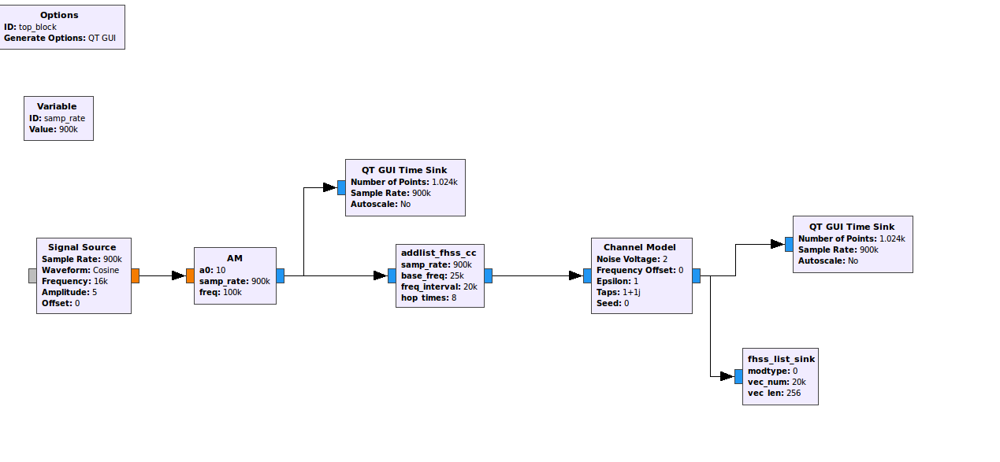
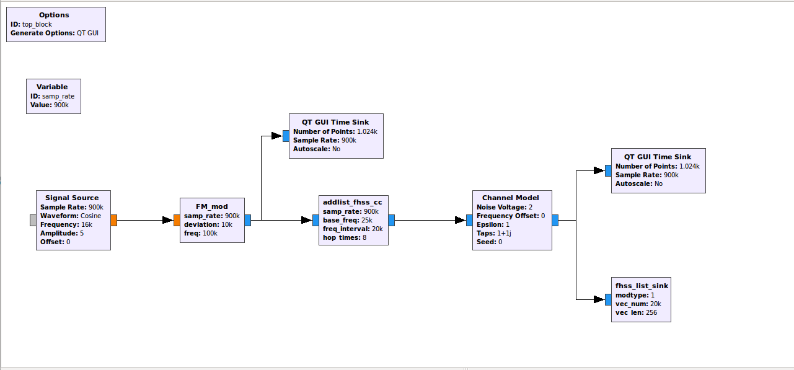
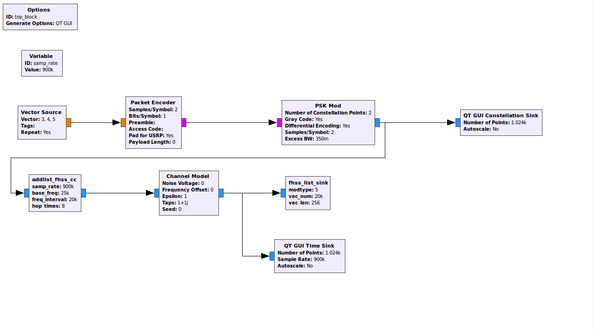
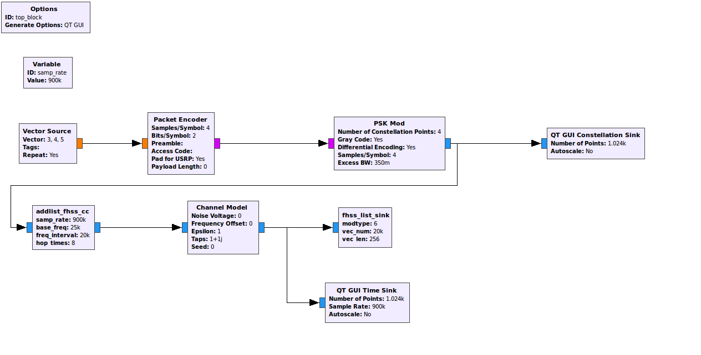
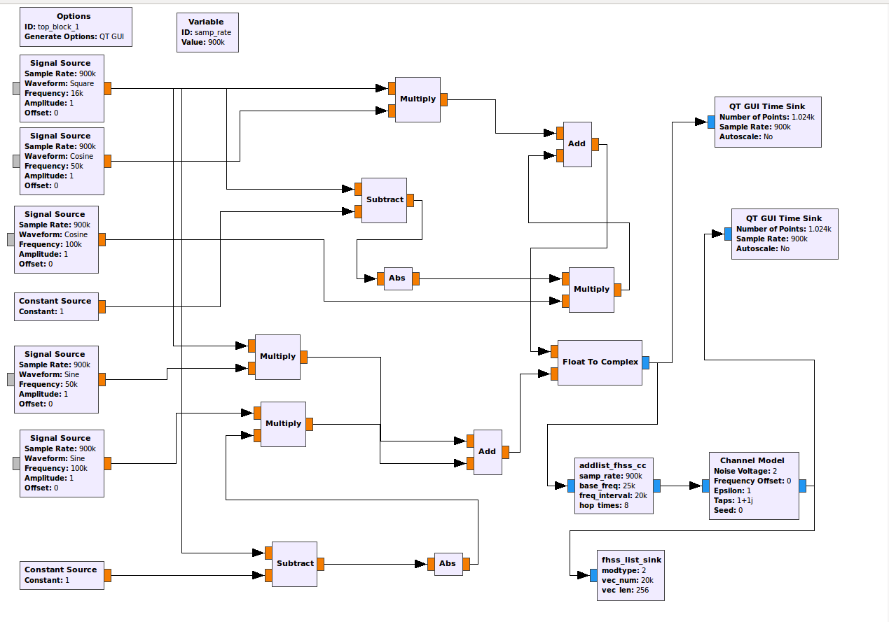

* Author:  Xing Jin

### Contains two parts:

**Part1: ** Use gnuradio to generate radio signal data sets under different modulation methods and different frequency hopping parameters, and combine with hackRF-One to add interference generated by sending and receiving in a real environment.

**Part2:  **Use deep networks such as RNN to estimate the location of the frequency hopping point.

---

**Pat1:** Build the RML-DateSet

There is a data generation flow diagram under the `./grc `, as shown in the figure below, for custom modules, see the` ./gr-my_fhss_v1/python`

AM_FHSS.grc

 FM-FHSS.grc

BPSK-FHSS.grc

QPSK-FHSS

2FSK-FHSS.grc

#### Tips:

`addlist_fhss_cc.py` and `add_fhss_cc.py`  generate frequency hopping period is 8 and the frequency hopping interval is 25Khz. The difference is that the length of a frequency hopping is not fixed, and the length of a frequency hopping is fixed and can be controlled by itself.

`fhss_list_sink` and `fhss_sink`  collecte and make data sets, and at the same time **normalized the data**.

Due to the limitation of the gnuradio cache size, the number of points fetched each time is 4096 or 4095, so it is necessary to design the corresponding algorithm to achieve, see `./collect-data-png` for specific implementation.

---

**Part2:** The estimation of  frequency hopping point.

​      To be continued !!!

